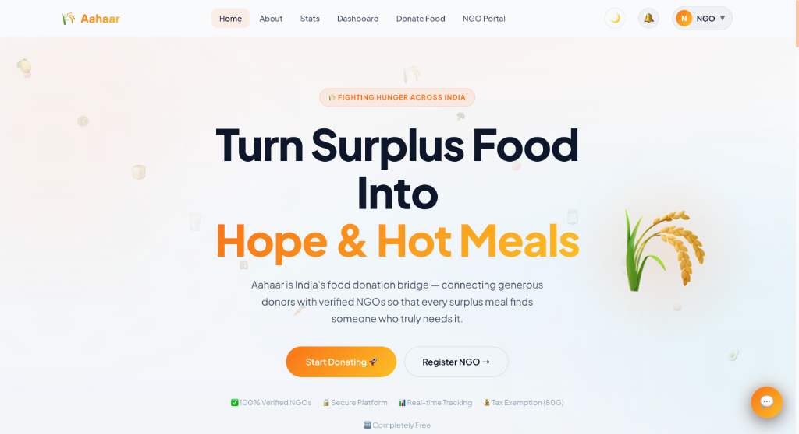
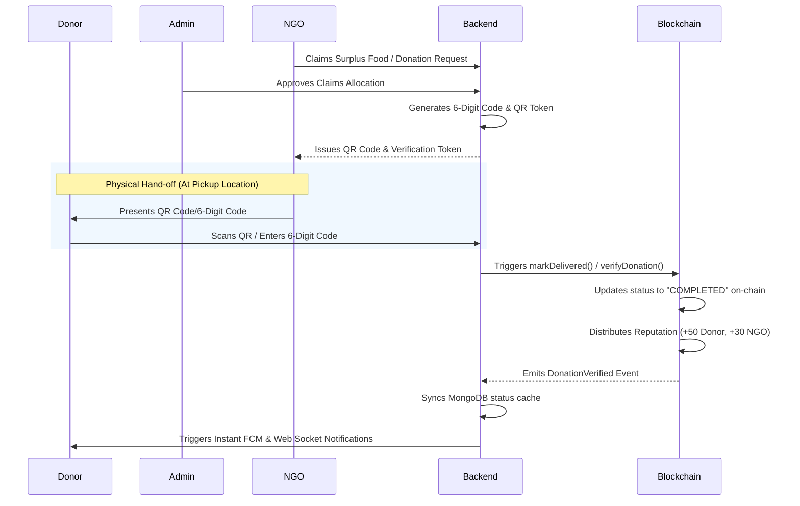
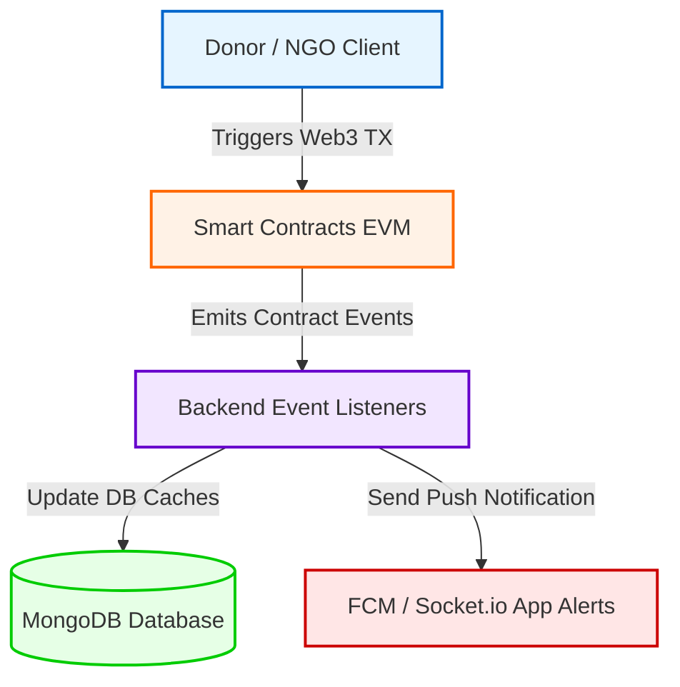
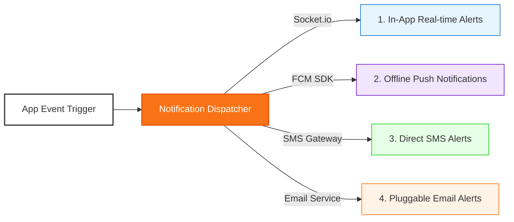
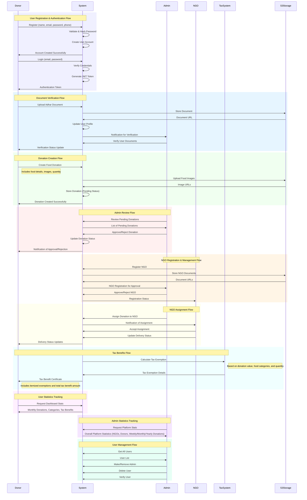

# AAHAAR: Donation Orchestration & Tax Benefit Platform

<p align="center">
  
</p>

<p align="center">
  <a href="#-features">Features</a> •
  <a href="#-system-architecture">Architecture</a> •
  <a href="#-functional-workflows">Workflows</a> •
  <a href="#-smart-contracts--blockchain-governance">Blockchain Governance</a> •
  <a href="#-section-80g-tax-exemption--pdf-receipt-engine">Tax Exemption & PDF Receipt Engine</a> •
  <a href="#-multi-channel-notification-engine">Notification Engine</a> •
  <a href="#-global-sdg-alignment--social-impact-framework">SDG & Social Impact</a> •
  <a href="#-tech-stack">Tech Stack</a> •
  <a href="#-getting-started">Getting Started</a> •
  <a href="#-api-endpoints">API Endpoints</a>
</p>

---

**AAHAAR** is a comprehensive, full-stack surplus food rescue, routing logistics, and tax benefit orchestration platform. By bridging the gap between food donors (wedding halls, restaurants, hotels, corporate kitchens, and individuals) and verified local non-governmental organizations (NGOs), Aahaar minimizes food waste while feeding underserved communities in real-time.



---

## 🚀 Key Features

* **Multi-Portal Experience**: Separate interactive dashboards for Donors, NGOs, and Administrators.
* **Document Verification Protocol**: Aadhaar validation for donors and registration certificate checks for NGOs via AWS S3 storage.
* **Real-time Status Tracking**: Instant status syncing (Pending, In Transit, Delivered) for all active donations.
* **Automated Exemption Module**: Built-in 80G tax benefit calculation and certificate generation.
* **Location-based Routing**: Matches surplus food listings with nearest certified NGOs.
* **Analytical Dashboards**: Aggregates weekly, monthly, and yearly statistics (meals served, active partners, total weight).
* **Decentralized Trust & DAO Governance**: Multi-sig/DAO mechanism to vote on NGO credentials, on-chain donation tracking, and a live web3 reputation system.
* **Cryptographic Handshake & QR Codes**: Dynamic verification QR codes for physical hand-off authentication and receipts verification.
* **Omni-channel Alerts**: Socket.io (live dashboards), FCM push notifications (mobile/background), SMS, and transactional email routing.

---

## 📊 System Architecture

The platform features a hybrid real-time alert and background push notification delivery pipeline utilizing **Socket.IO** for live, interactive dashboard notifications and **Firebase Cloud Messaging (FCM)** for background notifications when browser tabs are closed:


---

## 🔄 Functional Workflows

### 1. Donor Portal (How it works & Donating)
* **Onboarding**: Users create an account and upload their Aadhaar Card to verify donor identity.
* **Surplus Listing**: Donors submit food listings by providing description tags, categories (e.g. Cooked Meals, Grains, Bakery items), shelf life/expiry time, and pictures.
* **Status Updates**: Donors can track who picked up their donation and check delivery history.
* **Impact Tracking**: Personalized donor dashboard displays total donations created, success rate percentage, and meals served.

### 2. NGO Portal (Claim & Onboard)
* **Registration**: NGOs register with PAN credentials and operational cities, uploading registration certificates for administrative verification.
* **Request Pipeline**: NGO representatives can view nearby available donations or submit custom food requests for local distribution drives.
* **Fulfillment Management**: NGOs claim allocations, manage transport pickup times, and update fulfillment statuses.

### 3. Admin Control Panel (Verification & Routing)
* **Credential Verification**: Admins audit donor Aadhaar cards and NGO registration certificates.
* **Logistic Assignment**: Match and assign approved food listings to active nearby NGO distribution partners.
* **System Metrics Monitoring**: Review platform-wide statistics like total active users, registered NGOs, and cumulative meals served.


---

## 🏢 Corporate CSR & ESG Impact Portal

Aahaar provides corporate donors with a high-fidelity **Corporate Social Responsibility (CSR)** dashboard that enables real-time monitoring and reporting of social and environmental impact. This showcase is directly integrated into the landing page to demonstrate the system's capabilities:

1. **Contributions Ledger (Audit Trail)**: Previews a comprehensive ledger of all corporate donations, linking each drop-off to its corresponding timestamp, weight in kilograms, recipient NGO, transaction status, and on-chain transaction hash.
2. **Environmental & Carbon Offset Panel**: Tracks live greenhouse gas reduction metrics, meals distributed, and tree equivalents.
3. **80G Tax Exemption Portal**: Provides downloadable, pre-populated Section 80G trust certificates with explicit valuation parameters.
4. **Visual Analytics Suite**: Displays responsive progress gauges and categorizes distributions (Cooked Meals, Grains, Vegetables, Packaged Items) using modern CSS indicators.

---

## 🌱 Environment & Sustainability Mechanics

Aahaar converts raw food rescue statistics into actionable environmental ESG (Environmental, Social, and Governance) metrics using scientifically-backed formulas:

### 1. Landfill Methane Avoidance (Methane Offset Factor: 2.5)
When surplus food is dumped in landfills, anaerobic decomposition generates highly potent methane gas (which has a global warming potential 25x greater than CO₂). Aahaar uses a standard **landfill diversion multiplier of 2.5 kg CO₂ offset per kg of food saved** to model prevented landfill decay emissions.
$$\text{Carbon Reduction (kg CO₂)} = \text{Food Rescued (kg)} \times 2.5$$

### 2. Atmospheric Carbon Sequestration (Tree Equivalent Factor: 22)
To make the carbon reduction metrics intuitive for corporate stakeholders, the platform calculates the equivalent number of mature trees required to absorb that amount of carbon in a single year. This uses the standard EPA absorption rate of **22 kg CO₂ absorbed per tree per year**:
$$\text{Trees Planted Equivalent} = \frac{\text{Carbon Reduction (kg CO₂)}}{22}$$

### 3. Food-to-Meal Conversion Index (Multiplier: 2)
To represent the direct social impact of feeding hungry communities, weight is translated into standard meal portions. Using national nutritional guidelines, 1 kg of saved food is equivalent to **2 nutritious meals**:
$$\text{Meals Distributed} = \text{Food Rescued (kg)} \times 2$$

---

## 🌍 Global SDG Alignment & Social Impact Framework

Aahaar's surplus food rescue and redistribution pipelines directly address key United Nations Sustainable Development Goals (SDGs), converting environmental metrics into direct humanitarian impact:

* **SDG 2: Zero Hunger**: By bridging the gap between food donors (commercial kitchens, banquets, and supermarkets) and verified local NGOs, Aahaar redirects edible surplus food to underserved populations in real-time, tracked via a **1 kg = 2 nutritious meals** conversion factor.
* **SDG 12: Responsible Consumption and Production**: Aahaar tackles supply-chain food loss and waste by enforcing transparent logistic coordination. It prevents valuable nutritional resources from going to waste, encouraging commercial organizations to adopt circular economy practices and optimize resource allocation.
* **SDG 13: Climate Action**: Methane emission from landfill food waste is a major contributor to global warming. By diverting surplus food, Aahaar avoids anaerobic decay and reduces greenhouse gas emissions (estimated via a factor of **2.5 kg CO₂ offset per kg of food saved** and mapped to tree absorption equivalents at **22 kg CO₂/tree/year**).

---

## 🧾 Section 80G Tax Exemption & Valuation Engine

Aahaar simplifies social responsibility by offering tangible tax savings to verified donors under Section 80G.


### 1. 50% Tax Exemption Benefit
To comply with the strict legal guidelines of Section 80G of the Indian Income Tax Act, 1961, Aahaar calculates the tax exemption benefit as exactly **50% of the estimated food donation value** across all categories:
$$\text{Tax Exemption Benefit (₹)} = \text{Total Donation Value (₹)} \times 0.50$$

### 2. Itemized Food Valuation Index
Category-based base rates are applied to calculate the total donation value, adjusting for custom weights and volumes (e.g. converting grams/milliliters to standard kilograms/liters).

### 3. Premium Redesigned PDF Receipt Engine

Upon successful on-chain verification, donors can download a legally compliant PDF tax exemption certificate. The document is dynamically compiled using `pdfkit` (located in [pdfGenerator.js](file:///Users/santoshpatel/Aahaar/backend/utils/pdfGenerator.js)) and features advanced design elements to prevent forgery and duplication:

* **High-Fidelity Branding & Circular Clip**: The official Aahaar logo is clipped inside a vector-drawn circular mask utilizing a custom border radius with orange accents.
* **Translucent Watermark Layer**: A rotated background watermark reading **"AAHAAR"** is rendered at `0.04` opacity diagonally across the page, protecting the PDF against photocopy forgery.
* **Official Verification Stamp**: A green circular ink stamp mimicking a real verification stamp ("AAHAAR 80G COMPLIANT VERIFIED") is dynamically drawn with a `-10 degree` tilt on the signature block for authorized styling.
* **On-the-Fly Smartphone-Scannable QR**: Pre-fetches a dynamic QR code containing the full cryptographic ledger entry (Receipt number, transaction timestamp, donor PAN, verified recipient NGO, and itemized valuation summaries). Scanning the QR code with any standard smartphone reader immediately pulls up these details, facilitating instant tax audit verification.
* **Structured Itemized Valuation**: Automatically applies the 80G Indian Income Tax Act rules, estimating the food value by matching category base rates and listing a clear 50% tax exemption calculation alongside a digital signature frame.

---

## 🛡️ Identity Verification & Receipt Locks

To prevent fraud and comply with tax auditing, Aahaar uses a verification framework:
1. **Aadhaar Verification**: Donors submit Aadhaar documents to unlock standard donation portals.
2. **PAN Card Document Verification**: Donors must submit both their 10-character PAN number and upload a verification document (PDF/Image). This submits a verification request to the Admin Panel.
3. **Admin Verification Panel**: Admins review PAN documents directly in the **Users** tab of the Admin Panel, either approving or rejecting requests (specifying rejection reasons).
4. **Receipt Download Gate**: Section 80G tax benefit receipt downloads are strictly locked. Donors cannot download certificates unless their PAN card verification has been approved by an administrator.

---

## 🔄 Logistics Verification & Blockchain QR Handshake

To prevent fraudulent claims, minimize delivery disputes, and lock proof-of-delivery on-chain, Aahaar uses a secure cryptographic verification handshake:



1. **Token Generation (Allocations)**: When an administrator accepts an NGO's claim to a surplus listing, the backend generates a secure 6-digit verification code and a corresponding QR code containing a signed JSON payload with a unique tracking `token`.
2. **Physical Scan Verification**: During pickup, the NGO representative displays this QR code to the donor. The donor scans the QR code using their camera portal (or manually inputs the 6-digit code) to authenticate the physical hand-off.
3. **On-Chain Settlement**: Submitting this verification triggers a call to the smart contract:
   - `Donation.markDelivered(donationId, deliveryProofCID)`: Stores the IPFS hash representing the delivery proof.
   - `Donation.verifyDonation(donationId)`: Transition states on the blockchain to `Verified` (completed) and automatically invokes the `ReputationSystem` to reward points.
4. **Off-Chain Bypass Guarantee**: In cases of low connectivity at the pickup location, the system provides a secure administrative bypass key. An administrator can authorize an off-chain bypass to force-mark the request as completed, ensuring operational continuation while logging the administrative audit trail.

---

## ⛓️ Smart Contracts & Blockchain Governance

Aahaar integrates an EVM-compatible decentralized trust and governance layer utilizing Solidity smart contracts managed via Hardhat. This establishes on-chain accountability, transparent peer-voting for onboarding, and automated reputation scoring.

### 1. Smart Contract Suite

* **`ReputationSystem.sol`**: Manages reputation points for both donors and NGOs. Deployed as a UUPS Upgradeable proxy. Only authorized contracts can increment or decrement reputation (e.g., +50 points to donors and +30 to NGOs upon completed donation verification, and +100 to NGOs on initial successful onboarding verification).
* **`NGORegistry.sol`**: Stores NGO names, IPFS CIDs of documentation, and verification status. Interfaces directly with `ReputationSystem` to track historical registry credentials.
* **`DonationRequest.sol`**: Enforces that only verified NGOs can broadcast food requests on-chain. Tracks food details, targeted quantities, cities, and request lifecycles.
* **`Donation.sol`**: Orchestrates state transitions of donation claims (`Accepted -> PickedUp -> Delivered -> Verified`). Upon successful delivery verification by the claiming NGO or an administrator, it calls `ReputationSystem` to award points.
* **`AahaarDAO.sol`**: Governs peer onboarding and removal of NGOs. Verified NGOs or administrators create proposals (`Onboard` or `Remove`). Other verified NGOs cast votes, and if a proposal passes, the DAO executes the action and updates the `NGORegistry` status.

### 2. Hybrid Blockchain-Database Sync Architecture

The system coordinates off-chain performance (MongoDB) and on-chain immutability (Smart Contracts) through an asynchronous event listener pipeline:



* **Live Event Syncing**: The Node.js backend runs dedicated listeners (`listeners.js`) that intercept Solidity events (`NGORegistered`, `NGOVerified`, `NGORejected`, `DonationRequestCreated`, `DonationAccepted`, `DonationDelivered`, `DonationVerified`).
* **Fault-Tolerant Cache**: The database maintains a mirror of contract states. If the blockchain network is delayed, the app performs optimistic UI updates and updates the local state cache as soon as events are parsed.

## 🔔 Multi-Channel Notification Engine

To maintain real-time coordinator alerts across all participant roles, Aahaar uses a centralized dispatcher ([notification.service.js](file:///Users/santoshpatel/Aahaar/backend/services/notification.service.js)) that broadcasts notifications across four distinct channels:



* **1. Real-Time In-App Alerts (Socket.io)**: Emitter triggers send socket messages directly to personalized rooms. Dashboards update live statistics, alert feeds, and badges dynamically without requiring page refreshes (handled in [socket.service.js](file:///Users/santoshpatel/Aahaar/backend/services/socket.service.js)).
* **2. Offline Push Notifications (Firebase Cloud Messaging - FCM)**: If a user closes the browser or locks their phone, the FCM service compiles an APNs/FCM payload and delivers background push notifications to registered devices via the user's saved `fcmToken` (handled in [firebase.service.js](file:///Users/santoshpatel/Aahaar/backend/services/firebase.service.js)).
* **3. Direct SMS Gateway**: Dispatched via Twilio/SMS gateway triggers, sending real-time SMS status updates (e.g., "Donation Accepted", "OTP Verification Code") directly to the participant's registered phone number (handled in [sms.service.js](file:///Users/santoshpatel/Aahaar/backend/services/sms.service.js)).
* **4. Pluggable Email Alerts**: Sends structured HTML transaction emails detailing tax certificates, registration updates, and DAO proposal outcomes to the participant's registered email address (handled in [email.service.js](file:///Users/santoshpatel/Aahaar/backend/services/email.service.js)).

---

## 🛠 Tech Stack

| Layer | Technologies Used |
| :--- | :--- |
| **Frontend** | React.js, Redux (State Management), Material-UI (UI Library), Axios (API Client), Ethers.js (Web3 interaction) |
| **Backend** | Node.js, Express.js (REST APIs), JWT (Authentication), Ethers.js (Smart Contract listeners & execution) |
| **Database & Storage** | MongoDB with Mongoose (Schemas & Queries), AWS S3 (Secure Document Hosting), IPFS (Decentralized proof storage) |
| **Smart Contracts** | Solidity, Hardhat, Ethers.js, OpenZeppelin Upgradeable (UUPS proxy pattern) |

---

## 📁 Project Structure

```
Aahaar/
├── 📁 backend/
│   ├── 📁 blockchain/          # Blockchain listeners, contract instances, and DAO services
│   ├── 📁 controllers/         # Logic handlers for users, stats, NGOs, tax, admin
│   ├── 📁 middlewares/         # Auth verification, role checkers, async wrappers
│   ├── 📁 models/              # Mongoose database schemas
│   ├── 📁 routes/              # Express endpoint routers
│   ├── 📁 utils/               # Database setup, admin seed scripts, token generation
│   ├── 📄 server.js            # Node backend entry point
│   └── 📄 s3Config.js          # AWS S3 integration
├── 📁 frontend/
│   ├── 📁 src/
│   │   ├── 📁 blockchain/      # Deployed smart contract ABIs and configurations
│   │   ├── 📁 components/      # Chatbot, Navbar, and layout widgets
│   │   ├── 📁 pages/           # Admin, Donor, NGO Dashboards, and landing views
│   │   └── 📄 main.jsx         # Vite react entry point
├── 📁 hardhat/
│   ├── 📁 contracts/           # Solidity smart contracts (DAO, Registry, Donation, Reputation)
│   ├── 📁 scripts/             # Contract deployment and upgrade scripts
│   ├── 📁 test/                # Local network unit tests for smart contracts
│   └── 📄 hardhat.config.js    # Hardhat configuration (Localhost & Amoy networks)
└── 📁 images/                  # Platform screenshot assets
```

---

## 🚀 Getting Started

### Blockchain & Smart Contract Setup
1. Navigate to the hardhat directory:
   ```bash
   cd hardhat
   ```
2. Install dependencies:
   ```bash
   npm install
   ```
3. Start a local Hardhat node in a separate terminal window:
   ```bash
   npx hardhat node
   ```
   *(This boots up a local EVM RPC server at `http://127.0.0.1:8545` with chain ID `1337` and generates 20 pre-funded test accounts)*
4. In another terminal window, deploy the smart contracts to the localhost network:
   ```bash
   npx hardhat run scripts/deploy.js --network localhost
   ```
   *(This deploys UUPS upgradeable proxies, configures default roles, and writes the deployment addresses/ABIs to `backend/blockchain/contract-details.json` and `frontend/src/blockchain/contract-details.json`)*

### Backend Setup
1. Navigate to the backend directory:
   ```bash
   cd backend
   ```
2. Install dependencies:
   ```bash
   npm install
   ```
3. Create a `.env` file in the root of the backend folder:
   ```env
   MONGO_URI=your_mongodb_connection_string
   JWT_SECRET=your_jwt_secret
   PORT=5000
   AWS_ACCESS_KEY_ID=your_aws_access_key
   AWS_SECRET_ACCESS_KEY=your_aws_secret_key
   AWS_BUCKET_NAME=your_s3_bucket_name
   
   # Blockchain configs (defaults to Hardhat local)
   POLYGON_AMOY_RPC_URL=http://127.0.0.1:8545
   BACKEND_WALLET_PRIVATE_KEY=your_local_hardhat_first_account_private_key
   ```
4. Run the development server:
   ```bash
   npm run dev
   ```

### Frontend Setup
1. Navigate to the frontend directory:
   ```bash
   cd frontend
   ```
2. Install dependencies:
   ```bash
   npm install
   ```
3. Start the application:
   ```bash
   npm start
   ```

---

## 📝 API Endpoints

### Food Information
* `POST /api/foodInfo/createFoodInfo` - Create a new food donation
* `GET /api/foodInfo/getFoodInfo` - Retrieve all food donations
* `GET /api/foodInfo/getFoodInfoById/:id` - Fetch details for a specific donation
* `PUT /api/foodInfo/updateFoodInfo/:id` - Update food donation details
* `DELETE /api/foodInfo/deleteFoodInfo/:id` - Remove a food donation listing

### User Management
* `POST /api/users/register` - Create a new donor/user account
* `POST /api/users/auth` - Login user and generate access token
* `POST /api/users/logout` - Logout user and clear session

### NGO Management
* `POST /api/ngo/aahaarNgoDocumentsUpload` - Upload NGO documentation to AWS S3
* `POST /api/ngo/aahaarNgoDetails` - Register PAN card and operational credentials

---

## 🤝 Contribution & Licenses
Contributions are highly welcomed. Please feel free to open issues or submit pull requests. Licensed under the MIT License.

---

## 📊 Sequence Diagram (System Logistics)


